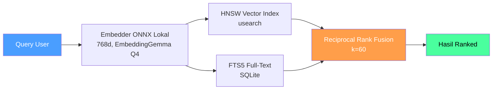

<p align="center">
  
</p>

<h1 align="center">Uteke</h1>
<p align="center"><strong>Satu memori. Semua agent. Tanpa cloud.</strong></p>
<p align="center">
  Beri AI kamu memori yang nggak pernah keluar dari laptop kamu. Mendukung Claude, Cursor, Copilot, dan semua agent yang kompatibel MCP.
</p>

<p align="center">
  <strong>98.4% LongMemEval-S recall@5</strong> · query hangat ~45 ms · <strong>0 LLM token</strong> per query · CPU-only · fully offline
</p>

<p align="center">
  <a href="https://github.com/codecoradev/uteke/actions/workflows/ci.yml?branch=develop"></a>
  <a href="https://github.com/codecoradev/uteke/releases"></a>
  <a href="https://github.com/codecoradev/uteke/stargazers"></a>
  <a href="https://opensource.org/licenses/Apache-2.0"></a>
  
  <a href="https://github.com/codecoradev/uteke/pkgs/container/uteke"></a>
  
  <a href="#-benchmark-984-recall-di-longmemeval-s"></a>
</p>

<p align="center">
  <a href="README.md">🇬🇧 English</a> · <strong>🇮🇩 Bahasa Indonesia</strong>
</p>

---

## ⚡ Mulai dalam 30 Detik

```bash
# Install (macOS, Linux, Windows)
curl -sSL codecora.dev/uteke/install | sh

# Simpan ingatan
uteke remember "Deploy v2.1 ke staging jam 3 sore"

# Cari lagi: berdasarkan makna DAN kata kunci
uteke recall "kapan deploy?"
```

**Selesai.** Tanpa API key, tanpa Python, tanpa cloud.

First run otomatis download embedding model (~200MB, sekali doang) dan langsung jalan.

Mau simpan dengan metadata lengkap?

```bash
uteke remember "Deploy v2.1 ke staging" \
  --tags deploy,staging \
  --entity staging-server \
  --category infrastructure
```

<details>
<summary>📦 Opsi install lainnya</summary>

| Metode | Command |
|--------|---------|
| **Homebrew** | `brew install codecoradev/tap/uteke` |
| **Cargo** | `cargo install uteke-cli` |
| **Docker** | `docker run -d -p 127.0.0.1:8767:8767 -v uteke-data:/data ghcr.io/codecoradev/uteke:latest` |
| **Binary** | [GitHub Releases](https://github.com/codecoradev/uteke/releases) (macOS, Linux, Windows) |
| **Windows (PowerShell)** | `powershell -ExecutionPolicy Bypass -Command "irm https://raw.githubusercontent.com/codecoradev/uteke/main/install.ps1 | iex"` |

📖 [Panduan install lengkap](INSTALL.md) · [Docker docs](docs/docker.md)
</details>

Baru kenal uteke (atau kamu *memang* AI agent)? Jalankan `uteke onboard`. Wizard-nya
mendeteksi setup, nanya agent apa yang kamu pakai, dan nyambungin semuanya. 📖 [Dokumentasi onboarding](docs/getting-started.md#interactive-onboarding)

---

## 📊 Benchmark: 98.4% recall di LongMemEval-S

[LongMemEval-S](https://arxiv.org/abs/2410.10813) (ICLR 2025) nyembunyiin fakta yang
dibutuhkan agent di ~115 sesi chat per pertanyaan, lalu ngecek apakah retrieval
menemukan buktinya. 500 pertanyaan hand-curated, lima kemampuan memori. Uteke
menjalankan suite penuh dengan **nol panggilan LLM di jalur retrieval**: embedding
lokal, satu CPU, deterministik.

| Metrik | Uteke **v0.17.0** | agentmemory¹ | BM25-only¹ |
|---|---|---|---|
| **recall_any@5** (bukti di top-5) | **98.4%** | 95.2% | 86.2% |
| recall_any@10 | 98.8% | 98.6% | 94.6% |
| **recall_all@5** (semua bukti, strict) | **88.0%**² | 88.2% MRR³ | n/a |
| LLM token / query | **0** | 0 | 0 |

<sub>¹ Angka publikasi agentmemory, benchmark yang sama, split 500 pertanyaan yang sama (basis recall_any@5 mereka; terverifikasi apples-to-apples di [head-to-head](docs/benchmarks.md#head-to-head-vs-published-systems)). ² Strict = *semua* sesi gold harus masuk top-5; 65% pertanyaan butuh beberapa sesi. Ceiling matematis 99.4%. ³ MRR, bukan recall_all (tidak bisa dibandingkan langsung; ditampilkan untuk kelengkapan).</sub>

<p align="center">
  
</p>

**Per kategori pertanyaan** (recall_any@5: cerita per kategori yang jarang ditampilkan tool lain):

| knowledge-update | single-session | temporal | multi-session |
|:---:|:---:|:---:|:---:|
| **100%** | 96.7–98.2% | **99.2%** | 98.3% |

Bagian sulit itu bukan menemukan *sebuah* jarum; bukti setiap pertanyaan ada di
top-50 (**nol meleset**). Sisa gap-nya: *urutan*, saat satu pertanyaan butuh
beberapa sesi sekaligus: strict recall_all@5 di angka 88.0% dengan ceiling 99.4%.

> **🎯 Jangan percaya benchmark kami. Jalankan sendiri.** Harness lengkapnya ada di
> repo ini: dataset publik, output raw di-commit untuk kedua rilis, scoring
> deterministik yang bisa kamu hitung ulang dalam ~20 baris Python. Tanpa perlu
> embedder untuk verifikasi, ~$10 untuk menjalankan 500 pertanyaan sendiri.
> **👉 [benchmarks/longmemeval/REPRODUCING.md](benchmarks/longmemeval/REPRODUCING.md)**

Juga tersedia: `uteke bench --counts 100,1000,10000` untuk latency/throughput di
mesin kamu sendiri. 📖 [Dokumentasi benchmark lengkap](docs/benchmarks.md) · [RESULTS.md](benchmarks/longmemeval/RESULTS.md)

---

## 💡 Buat Apa Uteke?

**🤖 Lagi bangun AI agent?** Kasih memori persisten tanpa dependency cloud. Agent kamu ingat preferensi user, keputusan sebelumnya, dan konteks, antar sesi, fully offline.

**👥 Kerja tim?** Pakai [Rooms](docs/rooms.md) buat share knowledge. Meeting notes, keputusan project, pilihan arsitektur: bisa dicari semua orang, dengan atribusi author.

**🔒 Bangun app buat domain sensitif?** Kesehatan, keuangan, legal: data tetap di mesin kamu. Nggak ada API call, nggak ada telemetri, nggak ada cloud. Embedding lokal (ONNX, 768d).

**⌨️ Power user yang hidup di terminal?** Uteke itu personal knowledge graph kamu. Simpan apapun, cari berdasarkan makna, hubungkan pikiran yang related. Semua dari command line.

---

## 🔥 Kenapa Uteke?

Bayangin: kamu baru habis 2 jam jelasin codebase ke ChatGPT. Sesi berikutnya? Kosong. Ulang dari nol. Lagi.

Setiap AI tool lupa. Context window penuh, sesi berakhir, dan AI kamu start over setiap kali. Uteke kasih memori persisten, dan semuanya tetap di mesin kamu.

| | **Uteke** | **Tool A** | **Tool B** | **Tool C** | **Tool D** | **Tool E** | **Tool F** | **Tool G** |
|---|---|---|---|---|---|---|---|---|
| **Bahasa** | Rust (satu binary) | Python (pip) | Python | TypeScript | TypeScript | Python | TypeScript | Go (satu binary) |
| **Setup** | Satu binary (`curl \| sh`) | pip install + venv | pip + Docker + Qdrant | npm + iii-engine | npm (Node.js) | pip + Docker + Neo4j | Cloud atau binary lokal | Satu binary |
| **API key** | ❌ Nggak perlu | ⚠️ Untuk embedding remote | ✅ OpenAI/LLM | ✅ LLM key | ✅ LLM key | ✅ LLM key | ⚠️ Cloud saja | ❌ Nggak perlu |
| **Bisa offline** | ✅ Full | ⚠️ Opsional | ❌ Cloud embedding | ❌ Butuh LLM | ❌ Butuh LLM | ❌ Butuh LLM + vector DB | ✅ Binary lokal + Ollama | ✅ Full |
| **Search** | **Fusion** (weighted RRF vector + hybrid; hybrid = HNSW + FTS5 RRF) | sqlite-vec + FTS5 | Vector + Graph | Vector + Graph | Vector | Hybrid (semantic + keyword + graph) | Vector + rerank | **FTS5 doang** |
| **Kecepatan recall** | ~45ms | ~50ms+ | Network round-trip | Network round-trip | Network round-trip | Network round-trip | Network round-trip | ~Cepat (lokal) |
| **Multi-agent** | ✅ **Rooms** (shared memory, cross-agent recall, atribusi author) | ✅ Multi-agent surface | ❌ | ✅ Shared server | ✅ Multi-agent groups | ❌ | ❌ | ⚠️ Share via MCP |
| **Time-travel** | ✅ Native point-in-time | ⚠️ Temporal triples | ❌ | ❌ | ❌ | ✅ Temporal graphs | ❌ | ❌ |
| **MCP server** | ✅ JSON-RPC + HTTP | ✅ stdio + SSE | ❌ | ✅ 54 MCP tools | ❌ | ✅ Graphiti MCP | ✅ MCP open-source | ✅ stdio MCP |
| **Data kamu** | ✅ Nggak pernah keluar dari mesin | ✅ Local-first | ⚠️ Dikirim ke cloud LLM | ✅ Lokal (iii-engine) | ⚠️ Dikirim ke cloud LLM | ⚠️ Dikirim ke cloud LLM | ⚠️ Di-host Cloudflare | ✅ Lokal |
| **Lisensi** | Apache 2.0 | MIT | Apache 2.0 | Apache 2.0 | Apache 2.0 | Apache 2.0 | MIT | MIT |

> **Catatan:** Label Tool (A–G) merepresentasikan kategori umum AI memory layer per
> Agustus 2026. Kemampuan dinilai dari dokumentasi publik dan bisa berubah. Tabel ini
> titik awal evaluasi kamu sendiri, bukan ranking definitif.

> **Uteke vs Tool A (Python local-first):** Dua-duanya local-first dengan semantic + FTS5 search. Keunggulan Uteke: **satu binary** (tanpa runtime Python), **time-travel native** (bukan temporal triples), **rooms**, dan **zero runtime dependency**.

> **Uteke vs Tool G (Go single binary):** Dua-duanya single-binary, offline, tanpa API key, dua-duanya punya MCP server. Tool G itu **FTS5-only** (keyword search doang). Uteke nambah **vector semantic search + RRF fusion + rooms + time-travel + graph relationships + smart decay + document engine + batch import**. Filosofi kesederhanaan yang sama, lebih banyak kemampuan.

> **Uteke vs Tool F (TypeScript mode lokal):** Tool F sekarang punya mode binary lokal dengan dukungan Ollama. Langkah solid ke arah offline-first. Tapi di baliknya tetap TypeScript/Node.js. Uteke itu Rust: footprint lebih kecil, startup lebih cepat, zero runtime. Uteke juga punya **hybrid search dengan FTS5** (mode lokal Tool F vector-only, tanpa fallback keyword).

> **Uteke vs Tool B/D/E:** Mereka powerful, tapi semua butuh cloud LLM API key + Docker infra. Data kamu dikirim ke provider LLM eksternal. Uteke jalan fully offline dengan embedding ONNX lokal. Tanpa Docker, tanpa Python, tanpa API key.

> **Uteke vs Tool C:** Tool C punya 54 MCP tools dan multi-agent shared memory via local engine. Keunggulan Uteke: **zero dependency** (tanpa npm, tanpa engine tambahan), **hybrid search** (Tool C tidak punya FTS5), dan **time-travel queries**.

---

## 🏠 Rooms: Shared Memory Multi-Agent

Memory layer lain cuma single-player: setiap fakta disimpan di `user_id` yang flat, nggak kelihatan sama agent lain. **Uteke Rooms** bikin multiple AI agent bisa share memory space dengan atribusi author.

```bash
# Bikin room shared
uteke room create "engineering" --description "Keputusan tim"

# Agent Alice simpan keputusan
uteke remember "Kita pilih Redis buat caching, bukan Memcached" \
  --room engineering --author alice

# Agent Bob tambah konteks
uteke remember "Redis cluster: 3 node, 2 replica tiap node" \
  --room engineering --author bob

# Agent manapun bisa recall history shared
uteke recall "caching decision" --room engineering
```

**Kenapa ini penting:**

| Masalah tanpa Rooms | Solusi dengan Rooms |
|---|---|
| Agent A nggak lihat memori Agent B | Shared space, cross-agent recall |
| Knowledge tim silo per user | Satu room, multiple author |
| Nggak ada cara tau siapa bilang apa | Author di setiap memori |
| Workflow multi-agent butuh sync manual | Agent share context otomatis |

📖 **[Dokumentasi Rooms lengkap →](docs/rooms.md)**

---

## ✨ Fitur

### Memori Inti

| Fitur | Apa fungsinya |
|-------|---------------|
| 🧠 **Hybrid + Fusion Search** | Cari berdasarkan makna (vector) + kata kunci exact (FTS5). Digabung dengan Reciprocal Rank Fusion (RRF). Sejak v0.16.0, `fusion` (weighted RRF dari ranking vector dan hybrid) jadi default recall strategy. |
| 🏠 **Rooms** | **Shared memory multi-agent.** Kelompokkan memori berdasarkan konteks (meeting, project, klien). Multiple agent baca/tulis ke room yang sama dengan atribusi author. Cross-agent recall tanpa sync manual. |
| ⏳ **Time-travel** | Recall memori seperti adanya di titik waktu manapun. `uteke recall "deploy" --at 2025-01-15` |
| 🏷️ **Metadata Kaya** | Tag, entity, kategori, key:value di setiap memori. |
| 🧩 **Tipe Memori** | Kategori bertipe (fact, procedure, decision, dll.) dengan auto-inferensi. |
| ✏️ **Partial Updates** | Ubah isi, tags, metadata, importance, atau type tanpa rewrite penuh. |
| 📎 **Citations** | Atribusi sumber di setiap memori (URL, file, user, batch import). |

### Search & Intelligence

| Fitur | Apa fungsinya |
|-------|---------------|
| 🔗 **Relationship Graph** | Hubungkan memori dengan edge bertipe (supersedes, contradicts, references). Auto-backlink. |
| 🔗 **Cross-Entity Linking** | Referensi dua arah memori↔dokumen via wikilink `[[doc-slug]]`. |
| 🤖 **Cosine Auto-Linking** | Otomatis bikin edge `similar_to` antar memori yang related. |
| 📉 **Smart Decay** | Skor importance komposit. Pin yang penting, biarkan yang basi memudar. |
| 📈 **Salience + Recency** | Boost recall dual-axis berdasarkan tipe dan usia memori. |
| 🔍 **Orphan Detection** | Cari memori terputus dengan importance rendah untuk dibersihkan. |
| 🌙 **Dream Cycle** | Maintenance satu perintah: lint → backlinks → dedup → orphans. |
| 🧬 **Consolidation** | Gabungkan memori room yang mirip jadi lebih sedikit dan lebih padat: planner level-segmen, kebijakan trust provenance, kontrol per-pasangan. |

### Integrasi

| Fitur | Apa fungsinya |
|-------|---------------|
| 🔌 **MCP Server** | JSON-RPC via stdio + Streamable HTTP. Langsung pakai dengan Claude Code, Cursor, Hermes. |
| 🖥️ **Mode Server** | Daemon persisten: eliminates cold-start embedding load di setiap call. |
| 📂 **Batch Import** | Import seluruh direktori dengan routing strategi otomatis (dokumen vs. memori). |
| 📝 **Document Engine** | Wiki/knowledge base dengan `uteke doc create/get/list` + auto-chunking. |
| 📥 **Import/Export** | Backup dan restore berbasis JSONL. |
| 🔑 **View-Only API Keys** | Token read-only untuk akses GET saja ke server. |
| 👤 **Tipe Author** | Atribusi `human` vs `agent` di setiap memori, konsisten di CLI, HTTP, dan MCP. |

### Performa & Privasi

| Fitur | Apa fungsinya |
|-------|---------------|
| 📦 **Single Binary** | Zero dependency. Tanpa Python, tanpa API key. Local-first secara default. |
| 🐳 **Docker Ready** | Image resmi di GHCR. Jalankan sebagai shared service untuk tim atau deployment cloud. |
| 🔒 **Fully Offline** | Embedding ONNX lokal (EmbeddingGemma Q4, 768d). Tanpa telemetri, tanpa cloud. |
| ⚡ **Recall Cache** | Cache LRU yang eliminate redundant embedding untuk query berulang. |
| 🔥 **Tiered Memory** | Tracking Hot/Warm/Cold dengan auto-cleanup memori basi. |
| 🔄 **Embed Fallback** | Degrade ke no-op embedder kalau local model gagal (nggak pernah crash). |
| 👥 **Namespace Multi-Agent** | Memori terisolasi penuh per agent, tanpa overhead. |
| 📊 **Benchmark** | `uteke bench` bawaan untuk perf testing. [Lihat hasil](docs/benchmarks.md). |

---

## 🚀 Cara Kerja



**Cara kerja hybrid search:**
1. **HNSW** (usearch): cari berdasarkan makna ("deploy" cocok dengan "rollout")
2. **FTS5** (SQLite): cari berdasarkan kata exact ("deploy" cocok dengan "deploy")
3. **RRF** (k=60): gabungkan dua ranked lists → terbaik dari keduanya

Semua jalan in-process. Tanpa network. Tanpa cloud. Tanpa server (kecuali mau pakai mode server).

<details>
<summary>🐳 Mode deployment (local-first secara default, Docker/server kalau perlu)</summary>

**Local-first (default)**: satu binary, zero infrastruktur.

```bash
curl -sSL codecora.dev/uteke/install | sh
uteke remember "memori pertama"
```

Data kamu tersimpan di `~/.codecora/uteke/`.

**Docker / mode server**: untuk tim atau agent remote.

```bash
docker run -d -p 127.0.0.1:8767:8767 -v uteke-data:/data ghcr.io/codecoradev/uteke:latest
# atau: uteke serve --host 0.0.0.0 --port 8767
```

📖 [Panduan Docker](docs/docker.md) · [Dokumentasi server mode](docs/configuration.md#server-mode)
</details>

<details>
<summary>🏠 Rooms: contoh shared memory multi-agent</summary>

```bash
# Bikin room shared
uteke room create "engineering" --description "Keputusan tim"

# Agent Alice simpan keputusan
uteke remember "Kita pilih Redis buat caching, bukan Memcached" \
  --room engineering --author alice

# Agent Bob tambah konteks
uteke remember "Redis cluster: 3 node, 2 replica tiap node" \
  --room engineering --author bob

# Agent manapun bisa recall history shared
uteke recall "caching decision" --room engineering
```

Atribusi author di setiap memori; cross-agent recall tanpa sync manual.
📖 [Dokumentasi Rooms lengkap →](docs/rooms.md)
</details>

<details>
<summary>🔌 Konfigurasi MCP: connect ke Claude Code, Cursor, Hermes</summary>

```jsonc
// .mcp.json (Claude Code, Cursor)
{ "mcpServers": { "uteke": { "command": "uteke-mcp" } } }
```

Untuk Claude Desktop, Hermes, dan HTTP transport, lihat [MCP docs](docs/mcp.md).
</details>

---

## 📚 Dokumentasi

| | |
|---|---|
| **Mulai** | [Installation](INSTALL.md) · [Getting started](docs/getting-started.md) · [Onboarding](docs/getting-started.md#interactive-onboarding) |
| **Referensi** | [CLI reference](docs/cli-reference.md) · [Konfigurasi](docs/configuration.md) · [Docker](docs/docker.md) |
| **Integrasi** | [Setup MCP](docs/mcp.md) · Claude Code · Cursor · Hermes |
| **Benchmark** | [docs/benchmarks.md](docs/benchmarks.md) · [RESULTS.md](benchmarks/longmemeval/RESULTS.md) · [Reproduksi sendiri](benchmarks/longmemeval/REPRODUCING.md) |

---

## ❓ FAQ

<details>
<summary><strong>Bedanya Uteke sama memory tool yang cloud-dependent apa?</strong></summary>

Banyak memory layer (basis Python atau TypeScript) butuh API key cloud (OpenAI/LLM) dan infrastruktur eksternal (Docker, Postgres, Qdrant). Data kamu dikirim ke cloud LLM provider. Uteke itu satu binary tanpa API key sama sekali. Semua embedding jalan lokal via ONNX. Data kamu nggak pernah keluar dari mesin kamu. [Lihat tabel perbandingan](#-kenapa-uteke).
</details>

<details>
<summary><strong>Bedanya sama platform MCP multi-tool?</strong></summary>

Beberapa platform menawarkan lusinan MCP tools dan multi-agent shared memory via local engine. Kaya integrasi, tapi butuh npm, runtime terpisah, dan LLM API key untuk embedding. Uteke itu Rust, zero dependency, dan jalan fully offline dengan embedding ONNX lokal. Mau integrasi maksimum → platform itu. Mau privasi, kecepatan, zero setup, dan hybrid search → Uteke.
</details>

<details>
<summary><strong>Bedanya sama single-binary memory tool lain?</strong></summary>

Beberapa single-binary tool share filosofi kami: satu binary, zero deps, MCP server, local-first. Beda kuncinya di **search**: kebanyakan **FTS5-only** (keyword matching). Uteke pakai **hybrid search** (HNSW vector similarity + FTS5 + Reciprocal Rank Fusion), jadi kamu bisa cari berdasarkan *makna*, bukan cuma kata exact. Uteke juga punya rooms, time-travel, graph relationships, smart decay, document engine, dan batch import.
</details>

<details>
<summary><strong>Beneran bisa offline?</strong></summary>

Ya. Embedding model (EmbeddingGemma Q4, 768d) download sekali (~200MB) saat first run. Setelah itu, zero network call. Tanpa telemetri. Kalau local model gagal, Uteke degrade ke no-op embedder, jadi nggak pernah crash dan nggak pernah manggil cloud API.
</details>

<details>
<summary><strong>Cepetan recall-nya?</strong></summary>

~45ms sebagai CLI (pengukuran: rata-rata 31ms @10K di bench host yang dipublikasikan) (diukur di 100–10K memori, flat mengikuti ukuran store). Nggak ada network round-trip karena semuanya lokal. Recall cache LRU menghilangkan komputasi embedding berulang untuk query yang sama.
</details>

<details>
<summary><strong>Bisa dipakai sama AI tool yang udah ada?</strong></summary>

Bisa. Uteke punya MCP server yang langsung pakai dengan Claude Code, Cursor, dan Hermes. Bisa juga pakai HTTP API langsung di bahasa pemrograman apapun. [Lihat setup MCP →](docs/mcp.md)
</details>

<details>
<summary><strong>Sudah production-ready?</strong></summary>

Uteke sekarang v0.17.0 dengan 200+ test, CI/CD di setiap commit, dan benchmark harness. Dipakai production oleh tim CodeCora dan early adopter lain. Masih di versi 0.x, jadi mungkin ada rough edges, tapi core-nya udah stabil.
</details>

---

## 🗺️ Roadmap & Editions

| | **Uteke OSS** (repo ini) | **Uteke Cloud** |
|---|---|---|
| Kualitas retrieval | ✅ Full (engine identik) | ✅ Identik (parity-benchmarked) |
| Lisensi | Apache-2.0, self-host | Layanan managed |
| Jawaban berbasis LLM (resolusi fakta recency-aware, abstention) | BYOK | Termasuk |
| Multi-workspace, dashboard, backup | DIY | ✅ Termasuk |
| Harga | Gratis | *Segera* |

Engine open-source tetap full-capability. Tidak ada bagian dari hasil benchmark di
 atas yang dipagari paywall. Cloud menambahkan kenyamanan hosted di atasnya.

---

## 🤝 Kontribusi

```bash
cargo build --workspace        # Build
cargo test --workspace         # Test (200+ test)
cargo clippy -- -D warnings    # Lint
cargo fmt                      # Format
```

Kontribusi diterima! Baca [CONTRIBUTING.md](CONTRIBUTING.md) untuk panduan lengkap.

---

## 📄 Lisensi

[Apache License 2.0](LICENSE). Pakai, fork, ship.

---

## ⭐ Star History

<p align="center">
  
</p>

---

<p align="center">
  <strong>Berguna?</strong> ⭐ Star repo ini. Bantu orang lain nemuin Uteke.
</p>
<p align="center">
  <a href="https://github.com/codecoradev/uteke/stargazers">
    
  </a>
</p>
