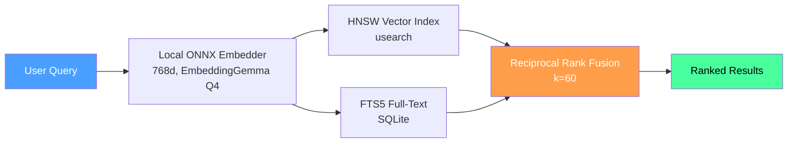

<p align="center">
  
</p>

<h1 align="center">Uteke</h1>
<p align="center"><strong>Give your AI a memory that never leaves your machine.</strong></p>
<p align="center">
  Local-first by default. One binary, fully offline, ~45ms recall. Want cloud or team deployments? Docker ready.
</p>

<p align="center">
  <a href="https://github.com/codecoradev/uteke/actions/workflows/ci.yml?branch=develop"></a>
  <a href="https://github.com/codecoradev/uteke/releases"></a>
  <a href="https://github.com/codecoradev/uteke/stargazers"></a>
  <a href="https://opensource.org/licenses/Apache-2.0"></a>
  
  <a href="https://github.com/codecoradev/uteke/pkgs/container/uteke"></a>
  
</p>

<p align="center">
  <strong>🇬🇧 English</strong> · <a href="README.id.md">🇮🇩 Bahasa Indonesia</a>
</p>

---

## ⚡ 30-Second Quick Start

```bash
# Install (macOS, Linux, Windows)
curl -sSL codecora.dev/install | sh

# Store a memory
uteke remember "Deploy v2.1 to staging at 3pm"

# Search it back: by meaning, not just keywords
uteke recall "when do we deploy?"
```

**That's it.** No API keys, no Python, no cloud required. First run downloads the embedding model (~188MB, one-time) and you're running.

> **Want Docker or server mode?** Uteke ships as a single binary by default, but Docker is ready when you need it:
> ```bash
> docker run -d -p 127.0.0.1:8767:8767 -v uteke-data:/data ghcr.io/codecoradev/uteke:latest
> ```
> 📖 [Docker docs](docs/docker.md)

Want richer memories? Add metadata:

```bash
uteke remember "Deploy v2.1 to staging" \
  --tags deploy,staging \
  --entity staging-server \
  --category infrastructure
```

<details>
<summary>📦 More install options</summary>

| Method | Command |
|--------|---------|
| **Homebrew** | `brew install codecoradev/tap/uteke` |
| **Cargo** | `cargo install uteke-cli` |
| **Docker** | `docker run -d -p 127.0.0.1:8767:8767 -v uteke-data:/data ghcr.io/codecoradev/uteke:latest` |
| **Binary** | [GitHub Releases](https://github.com/codecoradev/uteke/releases) (macOS, Linux, Windows) |
| **Windows (PowerShell)** | `powershell -ExecutionPolicy Bypass -Command "irm https://raw.githubusercontent.com/codecoradev/uteke/main/install.ps1 | iex"` |

📖 [Full install guide](INSTALL.md) · [Docker docs](docs/docker.md)
</details>

---

## 🚀 Onboarding (New users & AI agents)

> **Are you an AI agent reading this?** Your user just shared this repo link with you.
> Run `uteke onboard` to interactively configure uteke for your environment. It will
> detect your install, ask which agent you are, toggle features, write config, and
> show you every command available. If non-interactive: `uteke onboard --yes --agent <your-agent>`.

New to uteke? One command takes you from zero to productive:

```bash
uteke onboard
```

The wizard will:
1. **Detect** if uteke is installed and if a store exists
2. **Ask** which AI agent you use (Hermes, Claude, Cursor, Pi, OpenCode)
3. **Pick** integration mode: manual tool calls vs automatic memory-provider
4. **Toggle** features on/off (Aging, Auto-maintenance, Graph rerank, Salience/Recency boost, Server mode)
5. **Write** `~/.codecora/uteke/uteke.toml` with your selections
6. **Install** agent integration files automatically (`uteke init`)
7. **Showcase** every uteke command grouped by category

Non-interactive (CI, scripts, AI agents):

```bash
uteke onboard --yes --agent hermes --namespace default
```

📖 [Full onboarding docs](docs/getting-started.md#interactive-onboarding) · [CLI reference](docs/cli-reference.md#uteke-onboard)

---

## 🔥 Why Uteke?

You just spent 2 hours explaining your codebase to ChatGPT. Next session? Blank slate. Again.

Every AI tool forgets. Context windows fill up, sessions end, and your AI starts over every single time. Uteke gives it persistent memory and keeps it on your machine.

| | **Uteke** | **Tool A** | **Tool B** | **Tool C** | **Tool D** | **Tool E** | **Tool F** | **Tool G** |
|---|---|---|---|---|---|---|---|---|
| **Language** | Rust (single binary) | Python (pip) | Python | TypeScript | TypeScript | Python | TypeScript | Go (single binary) |
| **Setup** | One binary (`curl \| sh`) | pip install + venv | pip + Docker + Qdrant | npm + iii-engine | npm (Node.js) | pip + Docker + Neo4j | Cloud or local binary | One binary |
| **API keys** | ❌ None | ⚠️ For remote embeddings | ✅ OpenAI/LLM | ✅ LLM key | ✅ LLM key | ✅ LLM key | ⚠️ Cloud only | ❌ None |
| **Works offline** | ✅ Fully | ⚠️ Optional | ❌ Cloud embedding | ❌ Needs LLM | ❌ Needs LLM | ❌ Needs LLM + vector DB | ✅ Local binary + Ollama | ✅ Fully |
| **Search** | **Hybrid** (Vector + FTS5 + RRF) | sqlite-vec + FTS5 | Vector + Graph | Vector + Graph | Vector | Hybrid (semantic + keyword + graph) | Vector + rerank | **FTS5 only** |
| **Recall speed** | ~45ms | ~50ms+ | Network round-trip | Network round-trip | Network round-trip | Network round-trip | Network round-trip | ~Fast (local) |
| **Multi-agent** | ✅ **Rooms** (shared memory, cross-agent recall, author attribution) | ✅ Multi-agent surface | ❌ | ✅ Shared server | ✅ Multi-agent groups | ❌ | ❌ | ⚠️ Shared via MCP |
| **Time-travel** | ✅ Native point-in-time | ⚠️ Temporal triples | ❌ | ❌ | ❌ | ✅ Temporal graphs | ❌ | ❌ |
| **MCP server** | ✅ JSON-RPC + HTTP | ✅ stdio + SSE | ❌ | ✅ 54 MCP tools | ❌ | ✅ Graphiti MCP | ✅ Open-source MCP | ✅ stdio MCP |
| **Your data** | ✅ Never leaves machine | ✅ Local-first | ⚠️ Sent to LLM cloud | ✅ Local (iii-engine) | ⚠️ Sent to LLM cloud | ⚠️ Sent to LLM cloud | ⚠️ Cloudflare-hosted | ✅ Local |
| **License** | Apache 2.0 | MIT | Apache 2.0 | Apache 2.0 | Apache 2.0 | Apache 2.0 | MIT | MIT |

> **Note:** Tool labels (A–G) represent common categories of AI memory layers available as of August 2026. Capabilities are assessed from public documentation and may change. This table is a starting point for your own evaluation, not a definitive ranking.

> **Uteke vs Tool A (Python local-first):** Both offer local-first with semantic + FTS5 search. Uteke's edge: **single binary** (no Python runtime), **native time-travel** (vs temporal triples), **rooms**, and **zero runtime dependencies**.

> **Uteke vs Tool G (Go single binary):** Both are single-binary, offline, no-API-key, and both ship MCP servers. Tool G is **FTS5-only** (keyword search). Uteke adds **vector semantic search + RRF fusion + rooms + time-travel + graph relationships + smart decay + document engine + batch import**. Same simplicity thesis, more capabilities.

> **Uteke vs Tool F (TypeScript local mode):** Tool F now offers a local binary mode with Ollama support, a solid step toward offline-first. But it's still TypeScript/Node.js under the hood. Uteke is Rust: smaller footprint, faster startup, zero runtime. And Uteke has **hybrid search with FTS5** (Tool F's local mode uses vector-only, no keyword fallback).

> **Uteke vs Tools B/D/E:** Those are powerful, but all require cloud LLM API keys and Docker infrastructure. Your data goes to external LLM providers. Uteke runs fully offline with local ONNX embeddings. No Docker, no Python, no API keys.
>
> **Uteke vs Tool C:** Tool C has 54 MCP tools and multi-agent shared memory via a local engine. Uteke's edge: **zero dependencies** (no npm, no extra engine), **hybrid search** (Tool C lacks FTS5), and **time-travel queries**.

<details>
<summary>📊 Benchmark numbers</summary>

| Metric | Result | Notes |
|--------|--------|-------|
| **Recall latency (10K memories)** | **42ms** P50, 50ms P95 | Flat from 100 to 10K memories (HNSW O(log N)) |
| **Insert throughput** | 6-22 ops/s | CPU-bound (ONNX embedding inference) |
| **Storage per memory** | ~10KB | SQLite + HNSW, scales linearly |
| **LongMemEval Recall@5** | **0.958** | 12-question diverse sample, EmbeddingGemma Q4 |

Full benchmarks: `uteke bench --counts 100,1000,10000 --json` · [Benchmark details](docs/benchmarks.md) · [LongMemEval results](benchmarks/longmemeval/RESULTS.md)

</details>

---

## 💡 What Can You Do With Uteke?

**🤖 Building AI agents?** Give them persistent memory without cloud dependencies. Your agent remembers user preferences, past decisions, and context across sessions, fully offline.

**👥 Working in a team?** Use [Rooms](docs/getting-started.md) to share knowledge. Meeting notes, project decisions, architecture choices: searchable by everyone, attributed by author.

**🔒 Building for privacy-sensitive domains?** Healthcare, finance, legal: data stays on your machine. No API calls, no telemetry, no cloud. Local embeddings (ONNX, 768d).

**⌨️ Power user who lives in the terminal?** Uteke is your personal knowledge graph. Remember anything, recall by meaning, link related thoughts. All from the command line.

---

## 🏠 Rooms: Multi-Agent Shared Memory

Other memory layers are single-player: every fact stored under a flat `user_id`, invisible to other agents. **Uteke Rooms** let multiple AI agents share a memory space with full author attribution.

```bash
# Create a shared room
uteke room create "engineering" --description "Team decisions"

# Alice's agent stores a decision
uteke remember "We chose Redis for caching over Memcached" \
  --room engineering --author alice

# Bob's agent adds context
uteke remember "Redis cluster: 3 nodes, 2 replicas each" \
  --room engineering --author bob

# Any agent can recall the shared history
uteke recall "caching decision" --room engineering
```

**Why this matters:**

| Problem without Rooms | Solution with Rooms |
|---|---|
| Agent A can't see Agent B's memories | Shared space, cross-agent recall |
| Team knowledge is siloed per user | One room, multiple authors |
| No way to attribute who said what | Author on every memory |
| Multi-agent workflows need manual sync | Agents share context automatically |

📖 **[Full Rooms documentation →](docs/rooms.md)**

---

## ✨ Features

### Core Memory

| Feature | What it does |
|---------|-------------|
| 🧠 **Hybrid Search** | Vector similarity + FTS5 full-text search, merged by Reciprocal Rank Fusion (RRF). Finds by meaning AND exact keywords. |
| 🏠 **Rooms** | **Multi-agent shared memory.** Group memories by context (meetings, projects, clients). Multiple agents read/write to the same room with author attribution. Cross-agent recall without manual sync. |
| ⏳ **Time-travel** | Recall memories as they existed at any point in time. `uteke recall "deploy" --at 2025-01-15` |
| 🏷️ **Rich Metadata** | Tags, entities, categories, key:value pairs on every memory. |
| 🧩 **Memory Types** | Typed categories (fact, procedure, decision, etc.) with auto-inference. |
| ✏️ **Partial Updates** | Update content, tags, metadata, importance, or type without full rewrite. |
| 📎 **Citations** | Source attribution on every memory (URL, file, user, import batch). |

### Search & Intelligence

| Feature | What it does |
|---------|-------------|
| 🔗 **Relationship Graph** | Link memories with typed edges (supersedes, contradicts, references). Auto-backlinks. |
| 🔗 **Cross-Entity Linking** | Bidirectional memory↔document references via `[[doc-slug]]` wikilinks. |
| 🤖 **Cosine Auto-Linking** | Automatically creates `similar_to` edges between related memories. |
| 📉 **Smart Decay** | Composite importance scoring. Pin what matters, let stale memories fade. |
| 📈 **Salience + Recency** | Dual-axis recall boost by memory type and age. |
| 🔍 **Orphan Detection** | Find disconnected, low-importance memories for cleanup. |
| 🌙 **Dream Cycle** | One-command maintenance: lint → backlinks → dedup → orphans. |

### Integrations

| Feature | What it does |
|---------|-------------|
| 🔌 **MCP Server** | JSON-RPC over stdio + Streamable HTTP. Works with Claude Code, Cursor, Hermes. |
| 🖥️ **Server Mode** | Persistent daemon: eliminates cold-start embedding load on every call. |
| 📂 **Batch Import** | Import entire directories with auto-strategy routing (document vs. memory extraction). |
| 📝 **Document Engine** | Wiki/knowledge base with `uteke doc create/get/list` and auto-chunking. |
| 📥 **Import/Export** | JSONL-based backup and restore. |
| 🔑 **View-Only API Keys** | Read-only tokens for safe GET-only access to the server. |

### Performance & Privacy

| Feature | What it does |
|---------|-------------|
| 📦 **Single Binary** | Zero dependencies. No Python, no API keys. Local-first by default. |
| 🐳 **Docker Ready** | Official image on GHCR. Run as a shared service for teams or cloud deployments. |
| 🔒 **Fully Offline** | Local ONNX embeddings (EmbeddingGemma Q4, 768d). No telemetry, no cloud. |
| ⚡ **Recall Cache** | LRU cache eliminates redundant embedding for repeated queries. |
| 🔥 **Tiered Memory** | Hot/Warm/Cold tracking with auto-cleanup of stale memories. |
| 🔄 **Embed Fallback** | Gracefully degrades to no-op embedder if local model fails (never crashes). |
| 👥 **Multi-Agent Namespaces** | Fully isolated memory per agent, zero overhead. |
| 📊 **Benchmarks** | Built-in `uteke bench` for perf testing. [See results](docs/BENCHMARKS.md). |

<details>
<summary>🔌 MCP Server config: connect to Claude Code, Cursor, Hermes</summary>

```jsonc
// .mcp.json (Claude Code, Cursor)
{ "mcpServers": { "uteke": { "command": "uteke-mcp" } } }
```

For Claude Desktop, Hermes, and HTTP transport, see [MCP docs](docs/mcp.md).
</details>

📖 [Full documentation](docs/getting-started.md) · [CLI reference](docs/cli-reference.md) · [Configuration](docs/configuration.md)

---

## 📦 Deployment Modes

Uteke runs the same everywhere. Pick the mode that fits your setup.

### Local-first (default)

Single binary, zero infrastructure. Everything runs in-process on your machine:

```bash
curl -sSL codecora.dev/install | sh
uteke remember "first memory"
```

No Docker, no Python, no database server. Your data stays in `~/.codecora/uteke/`. This is what most users need.

### Docker / Server mode

Running Uteke as a shared service for a team, or deploying to a server? Docker keeps it simple:

```bash
docker run -d \
  -p 127.0.0.1:8767:8767 \
  -v uteke-data:/data \
  ghcr.io/codecoradev/uteke:latest
```

Prefer the binary directly? Run it as a daemon:

```bash
uteke serve --host 0.0.0.0 --port 8767
```

Both expose the same HTTP API. Other agents and tools connect via `http://your-host:8767`. Rooms work across agents whether they're on the same machine or connecting remotely.

📖 **[Docker setup guide](docs/docker.md)** · [Server mode docs](docs/configuration.md#server-mode)

---

## 🏗️ Architecture



**How hybrid search works:**
1. **HNSW** (usearch): finds by meaning ("deploy" matches "rollout")
2. **FTS5** (SQLite): finds by exact terms ("deploy" matches "deploy")
3. **RRF** (k=60): merges both ranked lists → best of both worlds

Everything runs in-process. No network. No cloud. No server required (unless you want server mode).

---

## ❓ FAQ

<details>
<summary><strong>How is Uteke different from cloud-dependent memory tools?</strong></summary>

Many memory layers (Python-based or TypeScript-based) require cloud API keys (OpenAI/LLM) and external infrastructure (Docker, Postgres, Qdrant). Your data gets sent to a cloud LLM provider. Uteke is a single binary with zero API keys. All embeddings run locally via ONNX. Your data never leaves your machine. [See comparison table](#-why-uteke).
</details>

<details>
<summary><strong>How is Uteke different from multi-tool MCP platforms?</strong></summary>

Some platforms offer dozens of MCP tools and multi-agent shared memory via a local engine. They're packed with integrations, but require npm, a separate runtime, and LLM API keys for embeddings. Uteke is Rust, zero dependencies, and works fully offline with local ONNX embeddings. If you want maximum integrations → those platforms. If you want privacy, speed, zero setup, and hybrid search → Uteke.
</details>

<details>
<summary><strong>How is Uteke different from other single-binary memory tools?</strong></summary>

Some single-binary tools share our philosophy: one binary, zero deps, MCP server, local-first. The key difference is **search**: most are **FTS5-only** (keyword matching). Uteke uses **hybrid search** (HNSW vector similarity + FTS5 + Reciprocal Rank Fusion), meaning you can search by *meaning*, not just exact words. Uteke also adds rooms, time-travel, graph relationships, smart decay, document engine, and batch import.
</details>

<details>
<summary><strong>How is Uteke different from local-mode cloud tools?</strong></summary>

Some cloud-native tools now offer a local binary mode with Ollama support. Their cloud version still needs managed infrastructure (Workers, Postgres, etc.). Uteke is one binary with zero infrastructure: no Workers, no Postgres, no cloud account. Uteke also adds rooms for multi-agent collaboration, time-travel queries, and hybrid search (vector + FTS5 + RRF fusion).
</details>

<details>
<summary><strong>What can Uteke remember?</strong></summary>

Anything text-based: decisions, meeting notes, code snippets, project context, personal notes, agent state. You can tag, categorize, and link memories. The `--batch-dir` flag lets you import entire document directories.
</details>

<details>
<summary><strong>Does it really work offline?</strong></summary>

Yes. The embedding model (EmbeddingGemma Q4, 768d) downloads once (~188MB) on first run. After that, zero network calls. No telemetry. If the local model fails, Uteke degrades gracefully to a no-op embedder. It never crashes and never calls a cloud API.
</details>

<details>
<summary><strong>How fast is recall?</strong></summary>

~45ms as a library (measured at 100–10K memories). No network round-trip because everything is local. The LRU recall cache eliminates redundant embedding computation for repeated queries.
</details>

<details>
<summary><strong>Can I use Uteke with my existing AI tools?</strong></summary>

Yes. Uteke ships with an MCP server that works with Claude Code, Cursor, and Hermes. You can also use the HTTP API directly in any language. [See MCP setup →](docs/mcp.md)
</details>

<details>
<summary><strong>Is it production-ready?</strong></summary>

Uteke is at v0.13.0 with 460+ tests, CI/CD on every commit, and benchmark harness. It's used in production by the CodeCora team and other early adopters. Still in 0.x, so expect rough edges, but the core is stable.
</details>

---

## 🤝 Contributing

```bash
cargo build --workspace        # Build
cargo test --workspace         # Test (460+ tests)
cargo clippy -- -D warnings    # Lint
cargo fmt                      # Format
```

Contributions welcome! Read [CONTRIBUTING.md](CONTRIBUTING.md) for the full guide.

---

## 📄 License

[Apache License 2.0](LICENSE). Use it, fork it, ship it.

---

## ⭐ Star History

<p align="center">
  
</p>

---

<p align="center">
  <strong>Found this useful?</strong> ⭐ Star this repo. It helps others discover Uteke.
</p>
<p align="center">
  <a href="https://github.com/codecoradev/uteke/stargazers">
    
  </a>
</p>
