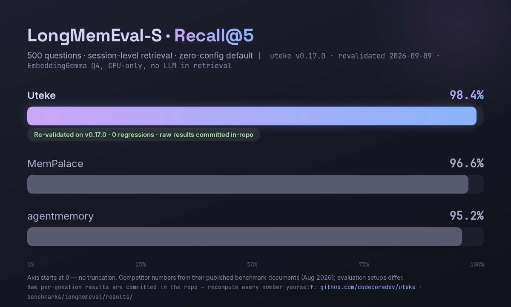

# Benchmarks

Real numbers from `uteke bench` on Oracle Cloud ARM (Ampere A1, 4 vCPU, 24GB RAM).
Embedding model: EmbeddingGemma Q4 (768d, ONNX Runtime, CPU-only).

## Results

Re-verified on the v0.17.0 release binary (2026-09-09, native aarch64 build,
[full run](../benchmarks/internal/RESULTS.md)):

| Scale | Insert ops/s | Insert Total | Recall Avg | Recall P95 | DB Size | Index Size |
|-------|-------------|-------------|------------|------------|---------|------------|
| 100 memories | 17.3/s | 5.8s | **31ms** | 47ms | 0.7MB | 0.31MB |
| 1,000 memories | 17.5/s | 57s | **42ms** | 62ms | 5.2MB | 3.10MB |
| 10,000 memories | 5.0/s | 33.4 min | **31ms** | 38ms | 80.7MB | 30.2MB |

<details>
<summary>Historical table (2026-08 run, v0.12.0-era, as originally published)</summary>

| Scale | Insert ops/s | Insert Total | Recall Avg | Recall P95 | DB Size | Index Size |
|-------|-------------|-------------|------------|------------|---------|------------|
| 100 memories | 18.5/s | 5.4s | **40ms** | 46ms | 708KB | 319KB |
| 1,000 memories | 21.8/s | 45.9s | **45ms** | 51ms | 5.3MB | 3.2MB |
| 10,000 memories | 6.0/s | 28.0 min | **42ms** | 50ms | 81.3MB | 30.3MB |

Storage matches the v0.17.0 run within a fraction of a percent.
</details>

## Key Takeaways

### Recall Latency: Flat ~30-45ms from 100 to 10K memories

The killer stat: recall latency barely changes as the store grows.

- 100 memories → **31ms**
- 1,000 memories → **42ms**
- 10,000 memories → **31ms** ← actually *faster* than 1K (warm ONNX cache)

HNSW search is O(log N), so even at 10K memories, the vector index adds <1ms.
The floor is dominated by ONNX embedding inference, not search. We quote ~45ms
in the headline as a conservative upper bound.

The full pipeline (fusion strategy, default since 0.16.0):
1. Query → ONNX embedding generation
2. HNSW vector search → vector ranking
3. FTS5 full-text search + RRF (k=60) → hybrid ranking
4. Weighted RRF fusion of the two rankings (#1123, tuned weights)

Retrieval quality (LongMemEval fast50, session-level): fusion R@5 0.98
vs hybrid 0.9267 vs vector-only 0.854. Vector and hybrid fail on
disjoint question sets — fusing captures both sides' wins.

No network round-trip. No API call. Everything in-process.

### Insert Throughput: 6-22 ops/s (CPU-bound)

Each insert requires an ONNX embedding pass (CPU inference). Throughput drops at scale because HNSW graph traversal grows as the index expands:

- 100 memories → **17.3 ops/s**
- 1,000 memories → **17.5 ops/s**
- 10,000 memories → **5.0 ops/s** (within run-to-run noise of the earlier 6.0)

At 5 ops/s, inserting 10K memories takes ~33 minutes. For bulk ingestion, use `uteke import` (batch mode) which pipelines embeddings.

### Storage Efficiency

- 100 memories → 0.7MB DB + 0.31MB index = **~10KB per memory**
- 1,000 memories → 5.2MB DB + 3.1MB index = **~8.3KB per memory**
- 10,000 memories → 80.7MB DB + 30.2MB index = **~11.1KB per memory**

Storage scales linearly (~10KB/memory). SQLite + HNSW both grow predictably.

## How to Reproduce

```bash
uteke bench --counts 100,1000,10000 --json
```

Or with a custom store path:

```bash
uteke bench --counts 100,1000 --store /tmp/bench --json
```

## External Evaluation

See [LongMemEval retrieval harness](https://github.com/codecoradev/uteke/tree/develop/benchmarks/longmemeval) for accuracy evaluation against standard benchmarks.

## LongMemEval-S — Retrieval Accuracy (500 questions)

Full-validation runs of the default strategy (fusion, zero-config) on
LongMemEval-S: 500 questions, session-level retrieval, ~115 haystack sessions per
question (2,415 unique sessions), EmbeddingGemma Q4 CPU-only, deterministic — no
LLM anywhere in the retrieval path. Originally validated on v0.16.0 and
re-validated end-to-end on the v0.17.0 release binary (2026-09-09).



### Headline numbers

Full 500-question basis, v0.17.0 re-validation (v0.16.0 original run alongside):

| Metric | v0.17.0 | v0.16.0 | What it means |
|---|---|---|---|
| **recall_any@5** | **98.4%** | 98.2% | At least one gold session in top-5 — the metric competitor benchmarks publish |
| recall_any@10 | 98.8% | 98.8% | |
| strict recall_all@5 | 88.0% | 88.0% | **Strict:** every gold session in top-5 (mathematical ceiling 99.4% — 3 questions have 6 gold sessions) |
| strict recall_all@10 | 95.4% | 95.4% | Every gold session in top-10 |
| coverage@5 | 94.4% | 94.3% | Partial credit per question |

On the 470 non-abstention questions (the 30 `_abs` abstention questions are
reported separately), strict recall_all@5 is 88.3% and coverage@5 is 94.7%.
Per-type breakdown, ablations, and the contradiction segment:
[benchmarks/longmemeval/RESULTS.md](../benchmarks/longmemeval/RESULTS.md).

Gold-session distribution across the 500 questions: 1 gold ×176, 2 ×250, 3 ×41,
4 ×19, 5 ×11, 6 ×3. 65% of questions have multiple gold sessions — which is why
we report the strict family at all.

### Why two metric families

`recall_any@K` passes a question when *at least one* gold session is retrieved.
It is the de-facto industry metric — and the one every competitor number in the
chart above uses. But a question whose answer needs evidence from 3 sessions is
only truly solved when **all 3** are retrieved. `recall_all@K` measures exactly
that. It is harder, bounded below recall_any, and to our knowledge no other
system in the comparison publishes it. We report both, from the same run, with
the same data.

### Head-to-head vs published systems

The agentmemory numbers quoted in the [README](../README.md#-benchmarks-984-recall-on-longmemeval-s)
are their published figures on the same benchmark and the same 500-question
split, on their own recall_any@5 basis — verified apples-to-apples before
quoting (their harness, their split, their metric definition). The BM25-only
column is their published lexical baseline, not our system. Our own FTS5
ablation on this dataset scores 91.4% any@5 ([RESULTS.md](../benchmarks/longmemeval/RESULTS.md)).

### Honesty notes

- The comparison chart mixes evaluation setups: uteke numbers come from our own
  harness on `longmemeval-s` (cleaned set); competitor numbers are from their
  published benchmark documents (accessed Aug 2026) and differ in embedding
  models and pipeline details.
- The FTS5-only bar is an ablation of our own system, not a competitor.
- Aggregate metrics + per-type breakdown: benchmarks/longmemeval/RESULTS.md in this repo. Canonical raw per-question artifacts are committed under benchmarks/longmemeval/results/ (default & FTS5-ablation 500-question runs, contradiction segment) — recompute any headline number straight from the repo; older exploratory outputs live on the benchmark Modal volume (uteke-longmemeval).

### Reproducibility

An independent local re-run (2026-09-01) of 108 of the 500 questions on a 4-core ARM desktop reproduced the published Modal x86 run: **107/108 questions produced identical per-question rankings**. The single difference was an adjacent-rank near-tie (identical top-10 set, one gold session swapped ranks 5-6) from cross-architecture floating-point noise. Aggregate R@5 on the subset: 96.7% / 99.4% (re-run) vs 96.7% / 100.0% (published). See the [Independent Reproduction section in RESULTS.md](../benchmarks/longmemeval/RESULTS.md) for the full table and reproduction command.

## Environment

| Component | Details |
|-----------|---------|
| Hardware | Oracle Cloud ARM (Ampere A1, 4 vCPU, 24GB RAM) |
| OS | Linux 6.8.0 (aarch64) |
| Rust | 1.85+ |
| Embedding | EmbeddingGemma Q4, 768d, ONNX Runtime CPU |
| Uteke | v0.16.0 validation + v0.17.0 re-validation (2026-09-09), both full 500 questions; perf table re-verified on v0.17.0 |

## Methodology

The benchmark uses `uteke bench` which:
1. Generates deterministic synthetic memories (seeded PRNG)
2. Inserts them one-by-one with embedding
3. Runs recall queries at each scale
4. Measures wall-clock time for insert and recall
5. Reports ops/s, latency percentiles, and storage footprint

No external services. No network. No Docker. Just the binary.
